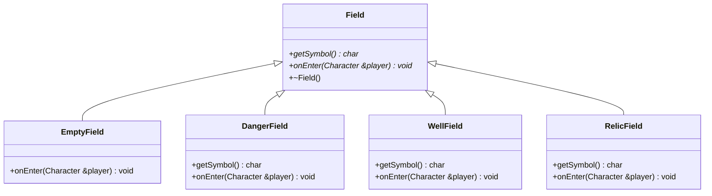
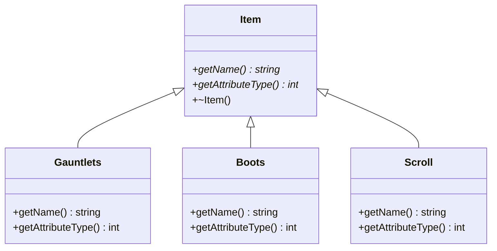

# Oasencrawler — Refactoring mit Polymorphie
### Von prozeduralen Mustern zu Unterklassen

*C++ Programmierung | Praktische Übung — Thema: Vererbung & Polymorphie | Bearbeitungszeit: ca. 90 Minuten*

---

## Lernziele

Nach dieser Übung können Sie:

- Prozedurale Typ-Unterscheidungen (if/else-Ketten, Integer-Codes) im bestehenden
  Code erkennen
- Entscheiden, wann eine Umwandlung in eine polymorphe Klassenhierarchie sinnvoll ist
- Eine Basisklasse mit virtuellen Methoden entwerfen und Unterklassen implementieren
- Bestehenden Code schrittweise refaktorisieren, ohne die Funktionalität zu verändern

---

## Szenario

Sie erhalten einen vereinfachten Ausschnitt aus einem Oasencrawler-Spiel. Der Code
verwendet an mehreren Stellen **Integer-Werte**, um verschiedene Typen zu
unterscheiden, und verzweigt dann mit **if-Ketten** je nach Typ in unterschiedliches
Verhalten. Das funktioniert zwar, hat aber mehrere Nachteile:

- Neue Typen erfordern Änderungen an vielen Stellen im Code
- Das Verhalten eines Typs ist über mehrere Dateien verstreut
- Der Compiler kann nicht prüfen, ob alle Typen behandelt werden

Ihre Aufgabe ist es, diese Muster zu erkennen und durch **Vererbung und Polymorphie**
zu ersetzen.

---

## Aufbau

Im Verzeichnis `code/` finden Sie folgende Dateien:

| Datei | Beschreibung |
|---|---|
| `field.h` / `field.cpp` | Ein `Field` mit Integer-Typ und if-Ketten in `getSymbol()` und `onEnter()` |
| `item.h` / `item.cpp` | Ein `Item` mit Integer-Typ und if-Ketten in `getName()` |
| `character.h` / `character.cpp` | Ein `Character` mit Inventar als `int items[3]` |
| `world.h` / `world.cpp` | Eine `GameWorld` mit `int world[3][3]` und if-Ketten in `getSymbol()` und `handleField()` |
| `main_vorher.cpp` | Zeigt, wie der Code **aktuell** funktioniert — kompilieren Sie das zuerst |
| `main.cpp` | Die **Ziel-Tests** — kompiliert erst nach Ihrem Refactoring |
| `Makefile` | `make vorher` und `make nachher` |

### Erster Schritt: Ausgangscode verstehen

Kompilieren und starten Sie den Ausgangscode:

```
make vorher
./vorher
```

Lesen Sie den Code in `field.cpp`, `item.cpp` und `character.cpp` aufmerksam.
Markieren Sie alle Stellen, an denen per `if(type == ...)` unterschieden wird.

> **Frage zum Nachdenken**
> Was müssten Sie alles ändern, wenn ein fünfter Feldtyp (z. B. ein Teleporter)
> hinzugefügt werden soll? An wie vielen Stellen im Code müssten Sie Änderungen
> vornehmen?

### Ziel

Ändern Sie `field.h/cpp`, `item.h/cpp`, `character.h/cpp` und `world.h/cpp` so, dass
`main.cpp` kompiliert und alle `assert`-Prüfungen bestehen:

```
make nachher
./nachher
```

> **Wichtig:** `main.cpp` darf **nicht** verändert werden! Die Datei definiert die
> Ziel-Architektur und prüft Ihre Lösung automatisch.

---

## Aufgabe 1 — Feldtypen als Klassenhierarchie

Aktuell ist `Field` eine einzelne Klasse mit einem `int type`. Die Methoden
`getSymbol()` und `onEnter()` entscheiden per if-Kette, was passieren soll.

**Refaktorisieren Sie `Field` in eine Klassenhierarchie:**



### Was zu tun ist

1. Machen Sie `Field` zu einer Basisklasse mit:
   - `virtual char getSymbol()` — gibt das Kartensymbol zurück (Standard: `'.'`)
   - `virtual void onEnter(Character &player) = 0` — rein virtuell
   - `virtual ~Field()` — virtueller Destruktor

2. Erstellen Sie vier Unterklassen, die jeweils `onEnter()` und ggf.
   `getSymbol()` überschreiben:

   | Klasse | `onEnter()` | `getSymbol()` |
   |---|---|---|
   | `EmptyField` | Nichts passiert | `'.'` (geerbt) |
   | `DangerField` | Spieler verliert 1 HP | `'!'` |
   | `WellField` | Spieler erhält 1 HP | `'~'` |
   | `RelicField` | Spieler erhält 1 Relikt | `'*'` |

3. Entfernen Sie das `int type`-Attribut — es wird nicht mehr gebraucht.

### Was `main.cpp` prüft

```cpp
Field* empty  = new EmptyField();
Field* danger = new DangerField();
Field* well   = new WellField();
Field* relic  = new RelicField();

assert(empty->getSymbol()  == '.');
assert(danger->getSymbol() == '!');
assert(well->getSymbol()   == '~');
assert(relic->getSymbol()  == '*');

Character player;
empty->onEnter(player);   assert(player.getHealth() == 5);
well->onEnter(player);    assert(player.getHealth() == 6);
danger->onEnter(player);  assert(player.getHealth() == 5);
relic->onEnter(player);   assert(player.getRelics() == 1);
```

Und ein **polymorphes Array** — alle Felder werden einheitlich behandelt:

```cpp
Field* world[4];
world[0] = new EmptyField();
world[1] = new WellField();
world[2] = new DangerField();
world[3] = new RelicField();

for (int i = 0; i < 4; i++) {
    world[i]->onEnter(player2);  // kein if noetig!
}
```

> **Wichtige Fragen**
> - Warum braucht `Field` einen virtuellen Destruktor?
> - Was passiert, wenn Sie `delete` auf einen `Field*` aufrufen, der eigentlich
>   auf ein `DangerField` zeigt, aber der Destruktor nicht `virtual` ist?

---

## Aufgabe 2 — Gegenstände als Klassenhierarchie

Aktuell ist `Item` eine einzelne Klasse mit `int type`. Die Methode `getName()`
verwendet eine if-Kette, um den richtigen Namen zurückzugeben.

**Refaktorisieren Sie `Item` in eine Klassenhierarchie:**



### Was zu tun ist

1. Machen Sie `Item` zu einer Basisklasse mit:
   - `virtual std::string getName() = 0`
   - `virtual int getAttributeType() = 0`
   - `virtual ~Item()`

2. Erstellen Sie drei Unterklassen:

   | Klasse | `getName()` | `getAttributeType()` |
   |---|---|---|
   | `Gauntlets` | `"Staerkehandschuhe"` | `0` |
   | `Boots` | `"Geschicklichkeitsstiefel"` | `1` |
   | `Scroll` | `"Weisheitsrolle"` | `2` |

### Was `main.cpp` prüft

```cpp
Item* gauntlets = new Gauntlets();
Item* boots     = new Boots();
Item* scroll    = new Scroll();

assert(gauntlets->getName() == "Staerkehandschuhe");
assert(boots->getName()     == "Geschicklichkeitsstiefel");
assert(scroll->getName()    == "Weisheitsrolle");

assert(gauntlets->getAttributeType() == 0);
assert(boots->getAttributeType()     == 1);
assert(scroll->getAttributeType()    == 2);
```

---

## Aufgabe 3 — Character-Inventar umstellen

Aktuell speichert `Character` sein Inventar als `int items[3]` — einen Zähler
pro Typ. Das muss sich ändern, damit polymorphe `Item`-Objekte gespeichert
werden können.

### Was zu tun ist

1. Ersetzen Sie `int items[3]` durch ein Array aus `Item*`-Zeigern
   (z. B. `Item* items[10]`) und einen Zähler für die aktuelle Anzahl

2. Ändern Sie `addItem` so, dass es einen `Item*` entgegennimmt:
   ```cpp
   void addItem(Item* item);
   ```

3. `useItem(int attributeType)` soll das Inventar durchsuchen, den ersten
   Gegenstand mit passendem Attribut-Typ finden, verwenden und entfernen.

4. Fügen Sie eine Methode `int getInventorySize()` hinzu, die die aktuelle
   Anzahl der Gegenstände zurückgibt.

5. Vergessen Sie nicht: Wenn `Character` zerstört wird, müssen alle `Item*`
   im Inventar per `delete` freigegeben werden.

### Was `main.cpp` prüft

```cpp
Character player3;
player3.addItem(new Gauntlets());
player3.addItem(new Boots());
player3.addItem(new Gauntlets());
player3.addItem(new Scroll());

assert(player3.getInventorySize() == 4);

assert(player3.useItem(1) == true);   // Boots gefunden
assert(player3.getInventorySize() == 3);

assert(player3.useItem(1) == false);  // keine Boots mehr
assert(player3.getInventorySize() == 3);

assert(player3.useItem(0) == true);   // erste Gauntlets
assert(player3.getInventorySize() == 2);

assert(player3.useItem(0) == true);   // zweite Gauntlets
assert(player3.getInventorySize() == 1);
```

> **Hinweis**
> Die Methode `useItem` braucht jetzt keinen `if`-Vergleich auf den Typ mehr —
> sie ruft einfach `getAttributeType()` auf dem Item-Objekt auf. Das ist der
> Kern der Polymorphie: der Aufrufer muss den konkreten Typ nicht kennen.

---

## Aufgabe 4 — Erweiterbarkeit beweisen: `TrapField`

Fügen Sie einen neuen Feldtyp `TrapField` hinzu:

- **Symbol:** `'.'` — sieht aus wie ein leeres Feld (versteckte Falle!)
- **Verhalten:** Der Spieler verliert sofort 1 HP beim Betreten

### Was `main.cpp` prüft

```cpp
Field* trap = new TrapField();
assert(trap->getSymbol() == '.');

Character player4;
trap->onEnter(player4);
assert(player4.getHealth() == 4);
```

> **Reflexionsfrage**
> Um `TrapField` hinzuzufügen, mussten Sie nur eine neue Klasse erstellen.
> Keine bestehende Datei musste geändert werden. Vergleichen Sie das mit der
> Ausgangssituation: Was hätten Sie in der alten Version alles ändern müssen?

---

## Aufgabe 5 — GameWorld: Polymorphie in Aktion

Aktuell verwaltet `GameWorld` ein 3x3-Raster als `int world[3][3]`. Die Methoden
`getSymbol()` und `handleField()` enthalten dieselben if-Ketten wie `Field` —
duplizierter Code, der bei jedem neuen Feldtyp angepasst werden muss.

**Vorher** (`handleField` — 20 Zeilen):
```cpp
void GameWorld::handleField(int x, int y, Character &player) {
    int type = world[y][x];
    if (type == 0) {
        // nichts
    }
    if (type == 1) {
        std::cout << "Gefahr! Du verlierst 1 HP." << std::endl;
        player.loseHealth();
    }
    if (type == 2) {
        std::cout << "Brunnen! Du erhaeltst 1 HP." << std::endl;
        player.gainHealth();
    }
    if (type == 3) {
        std::cout << "Relikt gefunden!" << std::endl;
        player.addRelic();
    }
    world[y][x] = 0;
}
```

**Nachher** (3 Zeilen):
```cpp
void GameWorld::handleField(int x, int y, Character &player) {
    world[y][x]->onEnter(player);
    delete world[y][x];
    world[y][x] = new EmptyField();
}
```

### Was zu tun ist

1. Ersetzen Sie `int world[3][3]` durch `Field* world[3][3]`

2. Der Konstruktor soll alle Felder mit `new EmptyField()` initialisieren

3. Ändern Sie `setField` so, dass es einen `Field*` entgegennimmt:
   ```cpp
   void setField(int x, int y, Field* field);
   ```
   Vergessen Sie nicht, das alte Feld per `delete` freizugeben!

4. `getSymbol(int x, int y)` delegiert an `world[y][x]->getSymbol()` —
   die gesamte if-Kette entfällt

5. `handleField(int x, int y, Character &player)` delegiert an
   `world[y][x]->onEnter(player)`, gibt das Feld frei und ersetzt es
   durch ein neues `EmptyField`

6. Der Destruktor muss alle 9 `Field*`-Zeiger per `delete` freigeben

### Was `main.cpp` prüft

```cpp
GameWorld gw;  // 3x3, alle EmptyField
assert(gw.getSymbol(0, 0) == '.');

gw.setField(0, 0, new WellField());
gw.setField(1, 0, new DangerField());
gw.setField(2, 0, new RelicField());
gw.setField(0, 1, new TrapField());

assert(gw.getSymbol(0, 0) == '~');
assert(gw.getSymbol(0, 1) == '.');  // Falle sieht leer aus

Character gwPlayer;
gw.handleField(0, 0, gwPlayer);
assert(gwPlayer.getHealth() == 6);
assert(gw.getSymbol(0, 0) == '.');  // jetzt leer
```

> **Wichtige Fragen**
> - Warum muss `setField` das alte Feld per `delete` freigeben, bevor es das neue setzt?
> - Was passiert, wenn der Destruktor die Felder nicht freigibt? (Stichwort: Memory Leak)
> - Vergleichen Sie `getSymbol` und `handleField` vorher/nachher — welche Version ist
>   einfacher zu erweitern?

---

## Erwartete Konsolenausgabe

Wenn Ihre Implementierung korrekt ist:

```
$ make vorher
$ ./vorher
Brunnen! Du erhaeltst 1 HP.
Gefahr! Du verlierst 1 HP.
Relikt gefunden!
Staerkehandschuhe gefunden!
Geschicklichkeitsstiefel gefunden!
Weisheitsrolle gefunden!
Brunnen! Du erhaeltst 1 HP.
Gefahr! Du verlierst 1 HP.
Relikt gefunden!
Alle Tests bestanden! (vorher)

$ make nachher
$ ./nachher
Alle Tests bestanden!
```

---

## Checkliste

- [ ] `make vorher` kompiliert und läuft fehlerfrei (Ausgangscode unverändert prüfen)
- [ ] `make nachher` kompiliert ohne Warnungen
- [ ] Alle `assert`-Prüfungen in `main.cpp` bestehen
- [ ] `main.cpp` wurde **nicht** verändert
- [ ] Keine if-Ketten auf Integer-Typen mehr in `field.cpp`, `item.cpp` und `world.cpp`
- [ ] Alle Basisklassen haben einen virtuellen Destruktor
- [ ] Dynamischer Speicher wird korrekt freigegeben (`delete` in Destruktoren)
- [ ] Sie können erklären, warum Polymorphie hier besser ist als if-Ketten

---

*Viel Erfolg!*
